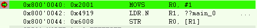

# Assignment 4

## Problem 1. Follow the same steps as we did in the class to blink LED1 (PA5) at a visible rate using the bit- band region to enable the clock for Port A, then answer the following

### a. What instructions does the compiler produce in assembly for “writing” to the RCC_AHB2ENR bit when using bit-band address?

These are the instructions produced for writing to RCC_AHB2ENR .

Basically, the contents of registr R0 (0) get copied to address 0x42420980 (LED 1)

### b. What were the instructions produced when writing to the RCC_AHB2ENR without using bit-banding?

## Problem 2. Create a function “func1” with 5 arguments and call “func1” from within another function “func2”. Trace thru the assembler and note:

a. How does the calling function “func2” pass the values to the called function “func1”?
b. What extra code did the compiler generate before calling the function “func1” with the
multiple arguments?
c. What extra code did the compiler generate inside the called function “funct1” with the
list of multiple arguments?
d. Any other observations?

## Problem 3. Following the queue data structure approach, design, implement and test a stack data structure

a. The following is the list of requirements:
i. The stack should have a predefined size
ii. The stack supports “int” data types.
iii. Provide a function to initialize the stack internals.
iv. Provide a function to push an element onto the stack
v. Provide a function to pop an element off the stack.
vi. Provide a function that returns 1 if stack is empty.
vii. Provide a function that returns 1 if stack is full.
viii. Return (-1) for error conditions
b. Provide a list of the test cases and their implementations inside of main.c
c. Separate the stack code from the rest of the test code (create stack.h & stack.c)

## Problem 4. Bonus: Using the power of pointers and type casting, create a function that can determine if a computer is big-endian or little-endian. Test your function in the simulator and modify the Project Options (as shown in the figure below) against

a. Cortex M4 (Little endian option)
b. Cortex M4 (Big Endian option)
