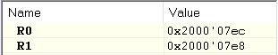
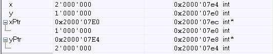
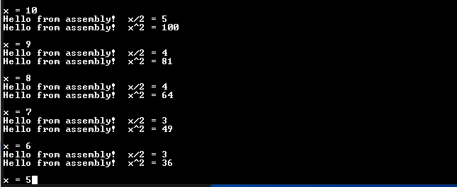

# Assignment 5 - EMBSYS 310 - AU21

1. Create a function in “C” that allows swapping of two pointers.
    a. Explain what the “main” function does in order to setup the input
        arguments prior to calling the swap_pointer() function?  
        ```To setup the input arguments, "main" stores the address of xPtr
        & yPtr to register R0 and R1.```

    b. What are the values in R0 & R1 when swap_pointer() is called?  
        `Below are the values of R0 & R1 before swap_pointer is called:`  
        

    c. Share a screen shot of the local variables inside of “main” after the
        function swap_pointer() returns showing the values of the pointers and
        what they are pointing to (similar to the picture below).  
        

2. Create a new file divAsm.s and add the file to the same HelloWorld project above.
    a. Start with the Assembly demo code shared in class (available under Module_06).  
    b. Write the assembly code to take an input argument, divide it by 2, and return the result.  

        ```asm
        divAsm
            PUSH {R0,LR}        // save the input argument and return address
            LDR R0,=myCstr      // load (global) address of address of string into R0
            LDR R0,[R0]         // load address of string into R0
            BL  PrintString     // call PrintString to print the string
            POP {R0,LR}         // Restore R0 and LR
            MOVS R1, #2         // R1 = 2
            SDIV R0, R0, R1     // R0 = R0 / R1 
            BX LR               // return (with function result in R0)

            END
        ```

    c. Invoke the function “PrintString” from within divAsm before doing the division
        computation.  
    d. Add a comment for every statement in your assembly function code.  
    e. Invoke divAsm() inside of your main function in main.c  
    f. Run your program on the board and capture a snapshot image of the output from
        TeraTerm showing the result of the divAsm.  
        

3. Implement a swap function in assembly and call it “swapCharsAsm”:
    a. It takes as input two variables of char data type each and swaps the two chars.  
        `x`

    b. Add a comment for every statement in your assembly function code.  
        `x`

    c. Bonus: Return 0 if the two chars are identical; otherwise, return 1.  
        `x`

4. Bonus: Implement the swap_pointer() function from #1 above in assembly and call it swapPointersAsm().
    a. Add a comment for every statement in your assembly function code.  
        `x`

    b. Invoke swapPointersAsm() from your main function main.c  
        `x`

    c. Run your program on the board and capture a snapshot image of the output from
        TeraTerm showing the result of the swapPointersAsm() subroutine.  
        `x`
